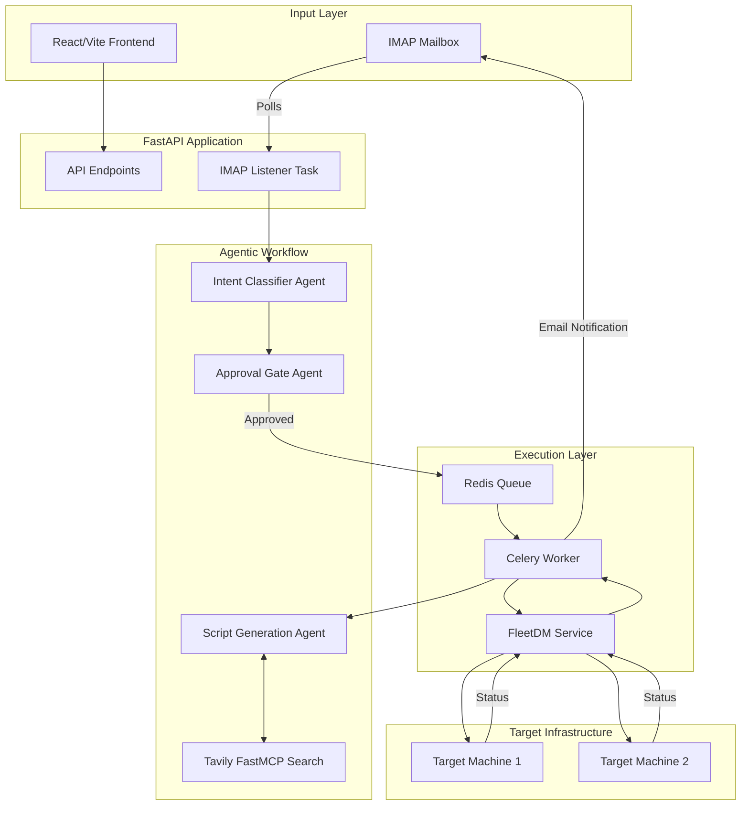

# ApplicationHub

ApplicationHub is an agentic software installation platform that enables fully automated, zero-touch software deployment to managed devices. 

Currently, the system is designed to intake installation requests via an **IMAP email listener**, process the natural language request using an **LLM-powered LangGraph workflow**, classify the intent, parse host details, dynamically generate an idempotent installation script using **Tavily/FastMCP** web searches, and execute the installation natively on target machines via **FleetDM** orchestrated by a **Celery** task queue and a **FastAPI** backend. The platform also includes a **React/Vite** frontend for monitoring and administration.

---

## Quick Start

For experienced developers, here is the fastest way to start the project locally (assuming Redis and Ollama are already running).

```bash
# 1. Clone the repository
git clone <repository_url>
cd ApplicationHub

# 2. Setup the backend using `uv`
cd backend
uv venv
source .venv/bin/activate
uv pip install -r requirements.txt
cp .env.example .env
# Edit .env with your specific credentials now!

# 3. Start the backend services (in separate terminals)
# Terminal 1 - FastAPI Server
cd backend && source .venv/bin/activate
uvicorn app.main:app --host 0.0.0.0 --port 8000 --reload

# Terminal 2 - Celery Worker
cd backend && source .venv/bin/activate
./worker.py

# 4. Setup and start the frontend
# Terminal 3 - React Frontend
cd frontend
npm install
npm run dev
```

---

## Current Architecture

Below is the current end-to-end architecture of ApplicationHub.



---

## Project Structure

```text
ApplicationHub/
├── backend/
│   ├── app/
│   │   ├── api/             # FastAPI routes and endpoints
│   │   ├── core/            # Configuration and logging
│   │   ├── database/        # SQLite models and session management
│   │   ├── graph/           # LangGraph agents and state management
│   │   ├── mail_listener/   # IMAP client, email parser, and listener
│   │   ├── services/        # FleetDM, LLM, Tavily, Redis, Email services
│   │   └── tasks/           # Celery tasks (installation_tasks.py)
│   ├── application_hub.db   # Local SQLite database (auto-generated)
│   ├── pyproject.toml       # Modern Python dependency configuration
│   ├── requirements.txt     # Locked dependencies generated by uv
│   ├── requirements.in      # Direct top-level dependencies
│   ├── worker.py            # Entry point to start the Celery worker
│   └── .env                 # Environment secrets (MUST NOT BE COMMITTED)
├── frontend/
│   ├── src/
│   │   ├── components/      # React UI components
│   │   ├── services/        # api.js containing frontend API URL
│   │   └── App.jsx
│   ├── package.json
│   ├── vite.config.js
│   └── tailwind.config.js
└── README.md
```

---

## System Requirements

| Component | Required Version | How to Check |
|---|---|---|
| OS | Ubuntu/Linux or macOS | `uname -a` |
| Python | >= 3.10 | `python3 --version` |
| uv | Not pinned (Latest) | `uv --version` |
| Node.js | >= 18.x (Recommended) | `node --version` |
| npm | >= 9.x (Recommended) | `npm --version` |
| Redis | 6.x or higher | `redis-server --version` |
| Ollama | Latest | `ollama --version` |
| Backend dependencies | Locked in requirements.txt | `uv pip list` |
| Frontend dependencies| Locked in package-lock.json| `npm list` |

---

## System Dependencies Before Python Installation

You must install these system-level dependencies before running the backend.

### 1. Redis
Used as the Celery message broker and for IMAP duplicate protection.
```bash
sudo apt update
sudo apt install redis-server
sudo systemctl enable redis-server
sudo systemctl start redis-server
```
Verify: `redis-cli ping` (Should return `PONG`)

### 2. Ollama
Used as the local LLM provider.
```bash
curl -fsSL https://ollama.com/install.sh | sh
```
Verify: `ollama --version`

### 3. Node.js & npm
Used for the React frontend.
```bash
sudo apt install nodejs npm
```
Verify: `node --version` and `npm --version`

---

## Ollama Setup

The system currently defaults to using the `gemma4:31b-cloud` model for intent classification, host parsing, and script generation.

1. Ensure Ollama is running (`systemctl status ollama` or run `ollama serve` in a background terminal).
2. Pull the required model:
```bash
ollama run gemma4:31b-cloud
```
*(Note: If you do not have this specific model, you can pull a different model like `llama3` and update the `LLM_MODEL` variable in your `.env` file.)*

---

## Environment Configuration

The backend relies entirely on environment variables loaded from a `.env` file located in the `backend/` directory. **DO NOT commit `.env` to GitLab!**

### `.env` Variable Reference

| Variable | Required? | Purpose | Example/Format | Where Used |
|---|---|---|---|---|
| `USE_FLEETDM` | Yes | Enable/disable actual FleetDM execution | `true` or `false` | Execution Layer |
| `FLEET_BASE_URL` | Yes (if Fleet enabled) | FleetDM API URL | `https://mdm.example.com` | FleetDM Service |
| `FLEET_API_TOKEN` | Yes (if Fleet enabled) | FleetDM authentication token | `ey...` | FleetDM Service |
| `SQLITE_PATH` | No | Database connection string | `sqlite:///./application_hub.db` | Database |
| `SMTP_ENABLED` | Yes | Enable notification emails | `true` or `false` | Email Service |
| `SMTP_SERVER` | Yes (if SMTP enabled) | Outgoing mail server | `smtp.example.com` | Email Service |
| `SMTP_PORT` | Yes (if SMTP enabled) | Outgoing mail port | `587` | Email Service |
| `SMTP_USERNAME` | Yes (if SMTP enabled) | SMTP auth username | `noreply@example.com` | Email Service |
| `SMTP_PASSWORD` | Yes (if SMTP enabled) | SMTP auth password | `secret` | Email Service |
| `SMTP_SENDER_EMAIL`| Yes (if SMTP enabled) | The "From" address for alerts | `noreply@example.com` | Email Service |
| `LLM_PROVIDER` | No | Provider type | `ollama` | LLM Service |
| `LLM_MODEL` | No | Model name | `gemma4:31b-cloud` | LLM Service |
| `LLM_BASE_URL` | No | Ollama URL | `http://localhost:11434` | LLM Service |
| `TAVILY_API_KEY` | Yes | Used for dynamic installation searches | `tvly-...` | FastMCP / Script Gen |
| `CELERY_BROKER_URL`| No | Redis URL for Celery broker | `redis://localhost:6379/1` | Celery config |
| `CELERY_RESULT_BACKEND`| No | Redis URL for Celery results | `redis://localhost:6379/1` | Celery config |
| `ENABLE_IMAP_LISTENER`| Yes | Start the IMAP listener loop | `true` | IMAP Listener |
| `IMAP_HOST` | Yes (if IMAP enabled) | Incoming mail server | `imap.example.com` | IMAP Listener |
| `IMAP_PORT` | Yes (if IMAP enabled) | Incoming mail port | `993` | IMAP Listener |
| `IMAP_USERNAME` | Yes (if IMAP enabled) | IMAP auth username | `listener@example.com`| IMAP Listener |
| `IMAP_PASSWORD` | Yes (if IMAP enabled) | IMAP auth password | `secret` | IMAP Listener |
| `IMAP_USE_SSL` | No | Use SSL for IMAP connection | `true` | IMAP Listener |
| `IMAP_POLL_INTERVAL`| No | Seconds between mailbox checks | `60` | IMAP Listener |

---

## Safe `.env.example`

Create a file named `.env` in the `backend/` directory using this template:

```ini
# Execution
USE_FLEETDM=true
FLEET_BASE_URL=https://mdm.example.com
FLEET_API_TOKEN=your_fleet_api_token

# AI / LLM
LLM_PROVIDER=ollama
LLM_MODEL=gemma4:31b-cloud
LLM_BASE_URL=http://localhost:11434
TAVILY_API_KEY=tvly-your_tavily_api_key

# Email Polling (Input)
ENABLE_IMAP_LISTENER=true
IMAP_HOST=imap.example.com
IMAP_PORT=993
IMAP_USERNAME=listener@example.com
IMAP_PASSWORD=your_imap_password
IMAP_USE_SSL=true
IMAP_POLL_INTERVAL=15

# SMTP (Notifications)
SMTP_ENABLED=true
SMTP_SERVER=smtp.example.com
SMTP_PORT=587
SMTP_USERNAME=noreply@example.com
SMTP_PASSWORD=your_smtp_password
SMTP_SENDER_EMAIL=noreply@example.com

# Infrastructure
CELERY_BROKER_URL=redis://127.0.0.1:6379/1
CELERY_RESULT_BACKEND=redis://127.0.0.1:6379/1
SQLITE_PATH=sqlite:///./application_hub.db
```

---

## Before Running on Another Machine

When a new developer clones this repository, they must update specific configurations.

### Must Change
1. **Frontend API URL**: In `frontend/src/services/api.js`, you must change `baseURL: 'http://192.168.10.83:8000'` to point to your local FastAPI instance (e.g., `http://localhost:8000` or your machine's IP).
2. **`.env` Credentials**: You must supply your own `FLEET_API_TOKEN`, `TAVILY_API_KEY`, `IMAP_PASSWORD`, and `SMTP_PASSWORD`. 
3. **IMAP Configuration**: Configure `IMAP_HOST` and `IMAP_USERNAME` to point to a mailbox you control for testing.

### May Change
1. **LLM Model**: If you do not have `gemma4:31b-cloud`, update `LLM_MODEL` to a model you have downloaded locally (e.g., `llama3`).
2. **Celery Redis DB**: If you use database `1` for something else, change `redis://127.0.0.1:6379/1` to `redis://127.0.0.1:6379/2`.

### Must NOT Change
1. **LangGraph Logic**: The core agent workflow is tightly coupled. Do not bypass the validation agents.
2. **SQLite Auto-generation**: The database tables (`application_hub.db`) are generated automatically by SQLAlchemy. Do not manually create them.

---

## Recommended Startup Order

1. Start/Verify **Redis** (`redis-server`)
2. Start/Verify **Ollama** (`ollama serve`)
3. Activate the backend virtual environment (`cd backend && source .venv/bin/activate`)
4. Start the **Celery Worker** (`./worker.py`)
5. Start the **FastAPI Server** (`uvicorn app.main:app --host 0.0.0.0 --port 8000 --reload`)
6. Start the **React Frontend** (`cd frontend && npm run dev`)

*Note: The FastAPI server automatically initializes the SQLite database upon startup if it does not exist.*

---

## Detailed Agentic Architecture

The system utilizes LangGraph to orchestrate a complex pipeline of AI agents:

**Input (Currently IMAP)**
 ↓
**EmailListener** (Polls mailbox, triggers intent classification)
 ↓
**IntentClassifier** (LLM extracts application, version, and host IPs)
 ↓
**ApprovalGate** (Waits for an admin to reply to the thread with an approval message)
 ↓
**Execution Handoff** (Job sent to Celery Worker)
 ↓
**ScriptGenerationAgent** (Generates idempotent scripts. If a script fails, it dynamically searches Tavily for official documentation and retries)
 ↓
**FleetDM Execution** (Uploads and runs script asynchronously)
 ↓
**MonitoringAgent** (Polls FleetDM for execution results)
 ↓
**VerificationAgent** (Runs a secondary verification script)
 ↓
**Notification** (Sends SMTP success/failure email)

---

## Email End-to-End Test

To test the system end-to-end, follow these steps:

### Test 1 - Installation Request
1. Send an email to the configured `IMAP_USERNAME` address.
2. **Subject:** `Software Installation Request`
3. **Body:** 
   ```text
   Please install Brave Browser version latest on host 192.168.13.106.
   ```
4. **Expected Result:** The `uvicorn` console will log that the email was detected. The Intent Classifier will parse it, and the graph state will change to `PENDING_APPROVAL`. No installation will occur yet.

### Test 2 - Approval
1. Reply directly to the *same email thread* from an admin account.
2. **Body:** `Approved.`
3. **Expected Result:** The listener detects the approval. The graph state changes to `APPROVED`. The job is handed off to Celery. Switch to your `./worker.py` terminal to watch the Script Generation Agent construct the installation script and dispatch it to FleetDM.

---

## API / Postman Testing

You can interact directly with the FastAPI backend without email using the built-in Swagger UI documentation.

1. Open a browser and navigate to: `http://localhost:8000/docs`
2. **Health Check:** Test the root endpoint `/` to ensure the API is running.
3. **Applications:** Test `GET /applications` to view the application registry.
4. **Trigger Installation:** You can use the `/install/{app_id}` endpoints to programmatically trigger installations, bypassing the email listener.

---

## Database Setup

The project uses **SQLite** by default for simplicity.
- The database file `application_hub.db` will be automatically created in the `backend/` directory when FastAPI starts.
- Tables (`Application`, `Strategy`, etc.) are created dynamically by SQLAlchemy. No manual migrations are required.

---

## FleetDM Setup

The application connects to a **Real FleetDM** instance to execute scripts natively on target hosts (macOS, Windows, Linux).

- The `USE_FLEETDM=true` flag must be set.
- Target machines must have the `fleetd` agent installed and be enrolled in your FleetDM instance.
- The Agent dynamically matches the IP address requested in the email to the specific `host_id` registered in FleetDM.

---

## GitLab Handover

When committing to GitLab, adhere to the following rules to protect credentials and environment specific configurations.

**DO Commit:**
- Application source code (`backend/app`, `frontend/src`)
- `requirements.txt`, `requirements.in`, `pyproject.toml`, `uv.lock`
- `frontend/package.json`
- `.env.example`
- `README.md`

**DO NOT Commit:**
- `.env` (contains actual API keys and passwords)
- `backend/application_hub.db` (local SQLite database)
- `.venv/` or `node_modules/`
- Any `logs/` or `repository/` file artifacts

*(Note: The repository contains a `.gitignore` file that automatically excludes these files).*

---

## Troubleshooting

| Problem | Cause | Fix |
|---|---|---|
| **Python syntax validation failed** | `uv` or Python 3.10+ not installed properly | Run `python3 --version`. Ensure you are using Python 3.10 or newer. |
| **ConnectionError to Redis** | Redis server is not running on port 6379 | Run `sudo systemctl start redis-server` and verify with `redis-cli ping`. |
| **Celery jobs are stuck in PENDING** | The `./worker.py` process is not running | Open a new terminal, activate the venv, and run `./worker.py`. |
| **Ollama connection refused** | Ollama daemon is offline | Run `ollama serve` or ensure the Ollama systemd service is active. |
| **Model not found error** | The LLM_MODEL in `.env` has not been downloaded | Run `ollama run gemma4:31b-cloud` to pull the model. |
| **Network Error / CORS in Frontend** | Frontend `api.js` points to the wrong IP | Edit `frontend/src/services/api.js` and change the `baseURL` to match your backend IP/port. |
| **IMAP Login Failed** | Incorrect `IMAP_PASSWORD` or App Password required | Check your `.env` IMAP credentials. If using Gmail/O365, generate an App Password. |
| **403 Forbidden in FleetDM Logs** | Invalid `FLEET_API_TOKEN` | Update the FleetDM token in your `.env`. |

---

## Current vs Future

### Currently Implemented
- Agentic Email parsing, intent classification, and approval gating.
- Dynamic cross-platform installation script generation.
- Dynamic web searching via Tavily for updated repository URLs upon script failure.
- SQLite-backed state tracking and script registry.
- End-to-end native execution via FleetDM.
- React frontend for viewing configurations.

### Future / Planned
- Integration with OTRS (Open Ticket Request System) to replace the temporary IMAP email listener as the primary input and approval source.
- Multi-tenancy and advanced role-based access control (RBAC).
