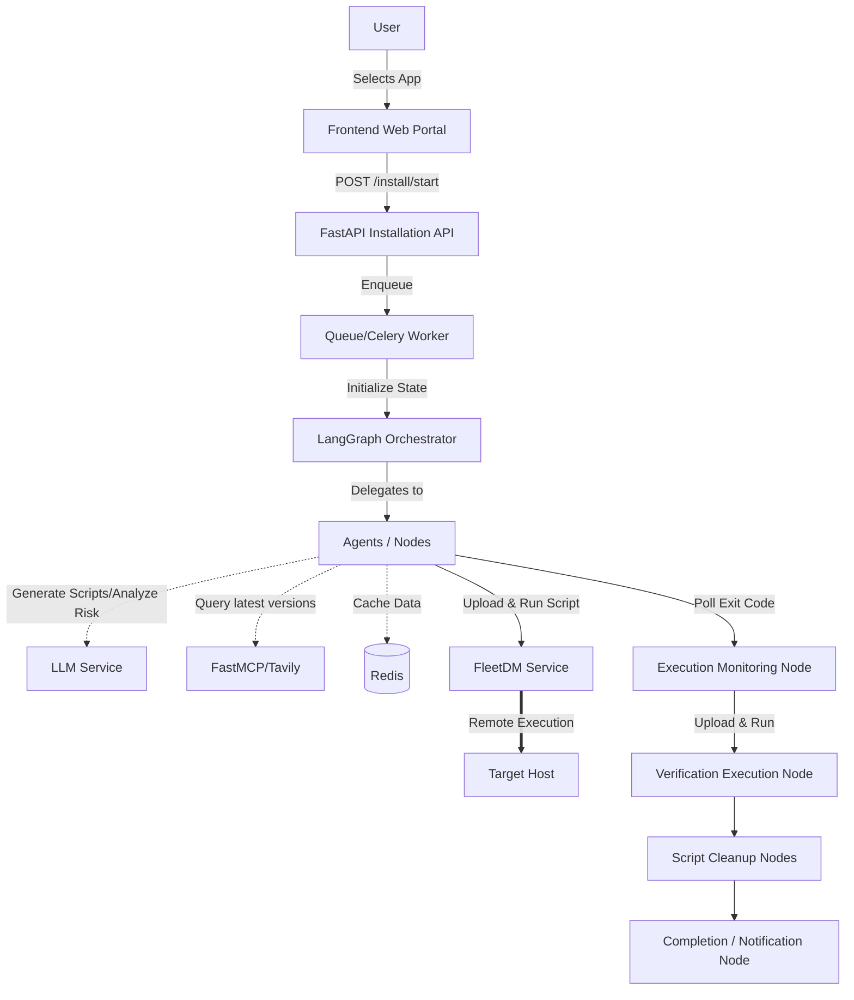
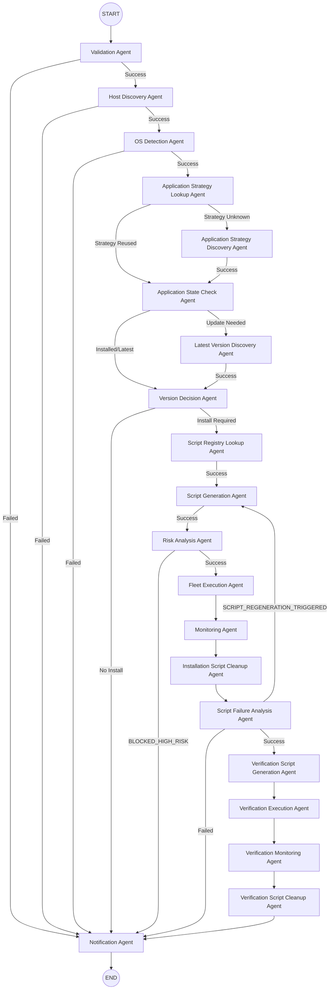
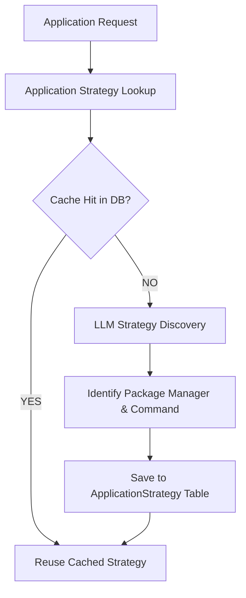

# ApplicationHub

ApplicationHub is an intelligent, agentic enterprise software portal (MVP) that allows organizations to seamlessly deploy software to end-user devices. It solves the problem of manual, error-prone software deployment by introducing a self-healing, agentic workflow capable of determining OS types, deciding optimal installation strategies, safely generating idempotent scripts, analyzing them for security risks, and executing them remotely.

The system is "agentic" because it doesn't rely on hard-coded bash scripts for every application. Instead, it utilizes Large Language Models (LLMs) to dynamically discover installation strategies, determine package availability, generate scripts, and detect high-risk behaviors autonomously. 

### How a request flows through the system
1. **Frontend (React)**: Users select software to install from a catalog.
2. **FastAPI**: Receives the request and queues a background installation job.
3. **Celery**: Picks up the queued job and triggers the main orchestration pipeline.
4. **LangGraph**: Orchestrates the multi-agent workflow, coordinating everything from device validation and OS detection to script generation and execution.
5. **FleetDM**: A device management platform used to discover target hosts, identify OS details, and execute scripts remotely on the end-user's machine.
6. **LLM (Ollama)**: Generates Python/Bash/PowerShell scripts and analyzes them for risk before execution.
7. **FastMCP / Tavily**: An intelligent integration that searches the web to determine the absolute latest software version if the user specifies "latest".
8. **Redis**: Caches LLM-discovered application strategies and versions to speed up subsequent installations.

---

## Current System Architecture

### Components
- **FastAPI**: Serves the REST API and WebSocket endpoints.
- **Celery Worker**: Executes the long-running LangGraph process.
- **LangGraph**: The state machine that controls the conditional flow between agents.
- **Agents/Nodes**: Individual Python functions representing discrete steps (e.g., Script Generation, Risk Analysis).
- **FleetDM**: The bridge to the actual user devices.
- **Monitoring & Verification**: Nodes that ensure the script executed successfully and the application is actually present on the target host.
- **Cleanup**: Ensures sensitive scripts are removed from FleetDM.

---

## Agentic Installation Flow

The core of the backend is built on LangGraph. Here is the complete workflow:

### Workflow Nodes

- **Validation** (`app/graph/nodes/validation.py`): Validates the job configuration.
- **Host Discovery** (`app/graph/nodes/host_discovery.py`): Retrieves the FleetDM host ID.
- **OS Detection** (`app/graph/nodes/os_detection.py`): Groups hosts by OS and architecture.
- **Application Strategy Lookup** (`app/graph/nodes/application_strategy_lookup.py`): Checks the database/cache for known installation methods for this OS.
- **Application Strategy Discovery** (`app/graph/nodes/application_strategy_discovery.py`): If no strategy is known, uses LLM to discover package managers and install commands.
- **Application State Check** (`app/graph/nodes/application_state_check.py`): Checks if the app is already installed on the host.
- **Latest Version Discovery** (`app/graph/nodes/latest_version_discovery.py`): Resolves "latest" requests using FastMCP/Tavily.
- **Version Decision** (`app/graph/nodes/version_decision.py`): Decides if installation should proceed based on target vs installed versions.
- **Script Registry Lookup** (`app/graph/nodes/script_registry_lookup.py`): (Legacy hook) Forwards to script generation.
- **Script Generation** (`app/graph/nodes/script_generation.py`): Uses LLM to generate OS-specific python/bash/powershell scripts.
- **Risk Analysis** (`app/graph/nodes/risk_analysis.py`): Uses LLM static analysis to block destructive or suspicious scripts.
- **Fleet Execution** (`app/graph/nodes/fleet_execution.py`): Uploads and triggers the script on FleetDM.
- **Monitoring** (`app/graph/nodes/monitoring.py`): Polls FleetDM for the execution exit code.
- **Installation Script Cleanup** (`app/graph/nodes/installation_script_cleanup.py`): Deletes the installation script from FleetDM.
- **Script Failure Analysis** (`app/graph/nodes/script_failure_analysis.py`): Analyzes non-zero exit codes to optionally trigger a script regeneration retry.
- **Verification Script Generation** (`app/graph/nodes/verification_script_generation.py`): Generates a secondary script to verify the app is installed.
- **Verification Execution** (`app/graph/nodes/verification_execution.py`): Uploads and runs the verification script on FleetDM.
- **Verification Monitoring** (`app/graph/nodes/verification_monitoring.py`): Polls the verification script exit code.
- **Verification Script Cleanup** (`app/graph/nodes/verification_script_cleanup.py`): Deletes the verification script.
- **Notification** (`app/graph/nodes/notification.py`): Sends success or failure emails.

---

## LangGraph Architecture

The LangGraph architecture is defined in `app/graph/graph.py` via `create_installation_graph()`.

- **State Definition**: The graph operates on the `InstallationState` TypedDict.
- **Routing**: Routing functions (e.g., `route_after_validation`, `route_after_strategy_lookup`) evaluate the current state and determine the next node using `workflow.add_conditional_edges()`.
- **Cancellation / Failure Paths**: Nearly every node checks `_is_cancelled_or_failed(state)`. If true, the graph immediately routes to the `notification` node, skipping execution.
- **Retry Paths**: `script_failure_analysis` evaluates failed executions. If retries are remaining, it returns `SCRIPT_REGENERATION_TRIGGERED`, looping the graph back to `script_generation`.

---

## Installation State

The `InstallationState` (defined in `app/graph/state.py`) holds the context of the workflow across all OS groups.

| Field | Type | Purpose | Set/Modified By |
|-------|------|---------|----------------|
| `job_id` | str | Unique identifier for the installation job | Setup/FastAPI |
| `application_name` | str | Target application | Setup/FastAPI |
| `version` | str | Raw requested version | Setup/FastAPI |
| `install_command` | Optional[str] | Verified manual command from DB | Setup/FastAPI |
| `host_ids` | List[int] | Target FleetDM host IDs | `host_discovery` |
| `os_details` | dict | OS details mapped by host_id | `os_detection` |
| `os_groups` | dict | host_ids mapped by OS signature | `os_detection` |
| `strategies` | dict | Install strategies mapped by OS | `application_strategy_lookup` |
| `requested_version` | str | Parsed requested version | `latest_version_discovery` |
| `discovered_latest_version`| str | Web-scraped version for "latest" | `latest_version_discovery` |
| `script_contents` | dict | LLM-generated script code | `script_generation` |
| `risk_scores` | dict | Assessed risk score (0-100) | `risk_analysis` |
| `fleet_script_ids`| dict | IDs of scripts uploaded to FleetDM | `fleet_execution` |
| `execution_ids` | List[str] | IDs of running executions in FleetDM | `fleet_execution` |
| `execution_results`| dict | Exit codes/outputs from executions | `monitoring` |
| `current_attempts`| dict | Counter for script retry loops | `script_generation` |
| `script_failure_context`| dict | Analysis of why previous script failed| `script_failure_analysis` |
| `status` | str | Overall job status | Various |
| `is_cancelled` | bool | Immediate abort flag | API / DB Check |

---

## Version Management

Version resolution happens dynamically based on the input:

- **Empty or "latest"**: Treated as a request for the newest version. The `latest_version_discovery` node uses a Redis cache. If it misses, it triggers a web search.
- **Explicit Version**: Triggers the `VersionAvailabilityService` to check if the specific version exists in the wild.
- **Availability States**:
  - `AVAILABLE`: The version was confirmed.
  - `NOT_AVAILABLE`: Trigger fallback to "latest".
  - `CHECK_FAILED`: The system cannot verify the version, triggering an abort to prevent unsafe deployments.

### FastMCP / Tavily Integration
If a "latest" request misses the Redis cache, the application uses **FastMCP**:
1. An in-memory FastMCP server is instantiated in `app/services/tavily_service.py`.
2. It exposes a single tool: `@mcp_server.tool() def search_tavily(query, search_depth)`.
3. The client connects via `Client(FastMCPTransport(mcp_server))`, triggering a web search for release notes.
4. The raw HTML/text results are passed to an LLM extraction prompt, which confidently extracts the semantic version number.
5. The result is cached in Redis (with a TTL) for future identical requests.

---

## Application Strategy System

Instead of relying solely on the LLM to guess how to install an app, ApplicationHub uses an intelligent strategy cache.

The Strategy defines the `package_manager` (e.g., apt, winget), `package_name`, and `installation_method`. Once discovered by the LLM, the strategy is saved via `ApplicationStrategyService` to the `application_strategies` table. This dramatically improves reliability, as subsequent installations for the same OS signature bypass the LLM discovery phase and use the exact, previously successful methodology.

---

## Requirements

The project uses the following dependencies:

| Package | Version |
|---|---|
| annotated-doc | 0.0.5 |
| annotated-types | 0.8.0 |
| anyio | 4.14.2 |
| certifi | 2026.7.22 |
| charset-normalizer | 3.4.9 |
| click | 8.4.2 |
| distro | 1.9.0 |
| exceptiongroup | 1.3.1 |
| fastapi | 0.141.1 |
| greenlet | 3.5.4 |
| h11 | 0.16.0 |
| httpcore | 1.0.9 |
| httpx | 0.28.1 |
| idna | 3.18 |
| jsonpatch | 1.33 |
| jsonpointer | 3.1.1 |
| langchain-core | 1.5.3 |
| langchain-protocol | 0.0.18 |
| langgraph | 1.2.10 |
| langgraph-checkpoint | 4.2.0 |
| langgraph-prebuilt | 1.1.0 |
| langgraph-sdk | 0.4.2 |
| langsmith | 0.10.17 |
| orjson | 3.11.9 |
| ormsgpack | 1.12.2 |
| packaging | 26.3 |
| psutil | 7.2.2 |
| pydantic | 2.13.4 |
| pydantic_core | 2.46.4 |
| python-dotenv | 1.2.2 |
| PyYAML | 6.0.3 |
| requests | 2.34.2 |
| requests-toolbelt | 1.0.0 |
| sniffio | 1.3.1 |
| SQLAlchemy | 2.0.51 |
| starlette | 1.3.1 |
| tenacity | 9.1.4 |
| typing-inspection | 0.4.2 |
| typing_extensions | 4.16.0 |
| urllib3 | 2.7.0 |
| uuid_utils | 0.17.0 |
| uvicorn | 0.52.1 |
| websockets | 15.0.1 |
| xxhash | 3.8.1 |
| zstandard | 0.25.0 |
| celery | 5.4.0 |
| fastmcp | 3.4.7 |
| mcp | 1.29.0 |

.env example
# Execution
USE_FLEETDM=true
FLEET_BASE_URL=https://mdm.example.com
FLEET_API_TOKEN=your_fleet_api_token

# AI / LLM
LLM_PROVIDER=ollama
LLM_MODEL=gemma4:31b-cloud
LLM_BASE_URL=http://localhost:11434
TAVILY_API_KEY=tvly-your_tavily_api_key

# Email Polling (Input)
ENABLE_IMAP_LISTENER=true
IMAP_HOST=imap.example.com
IMAP_PORT=993
IMAP_USERNAME=listener@example.com
IMAP_PASSWORD=your_imap_password
IMAP_USE_SSL=true
IMAP_POLL_INTERVAL=30

# SMTP (Notifications)
SMTP_ENABLED=true
SMTP_SERVER=smtp.example.com
SMTP_PORT=587
SMTP_USERNAME=noreply@example.com
SMTP_PASSWORD=your_smtp_password
SMTP_SENDER_EMAIL=noreply@example.com

# Infrastructure
CELERY_BROKER_URL=redis://127.0.0.1:6379/1
CELERY_RESULT_BACKEND=redis://127.0.0.1:6379/1
SQLITE_PATH=sqlite:///./application_hub.db