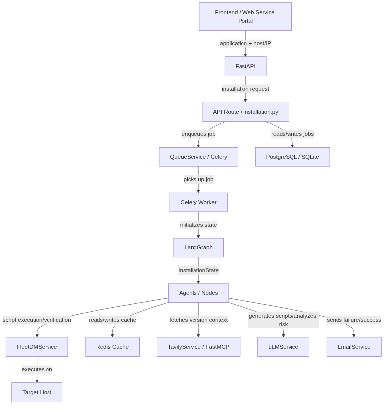
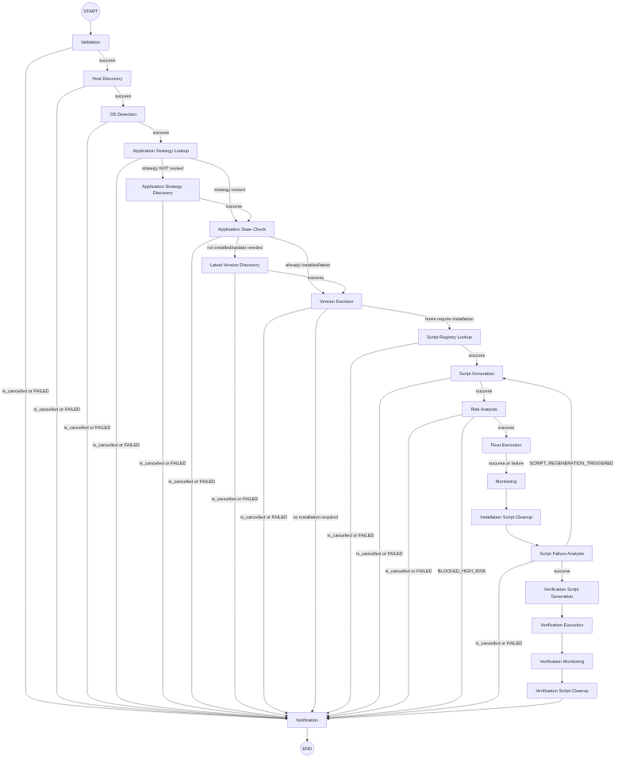
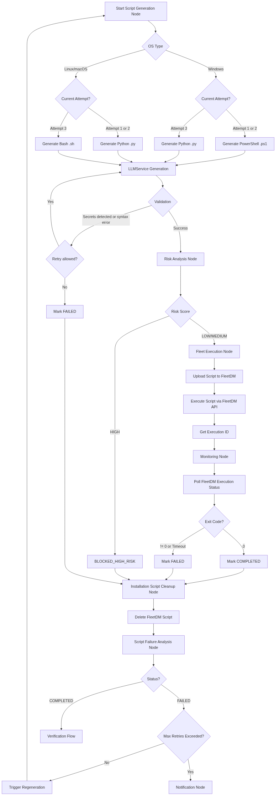
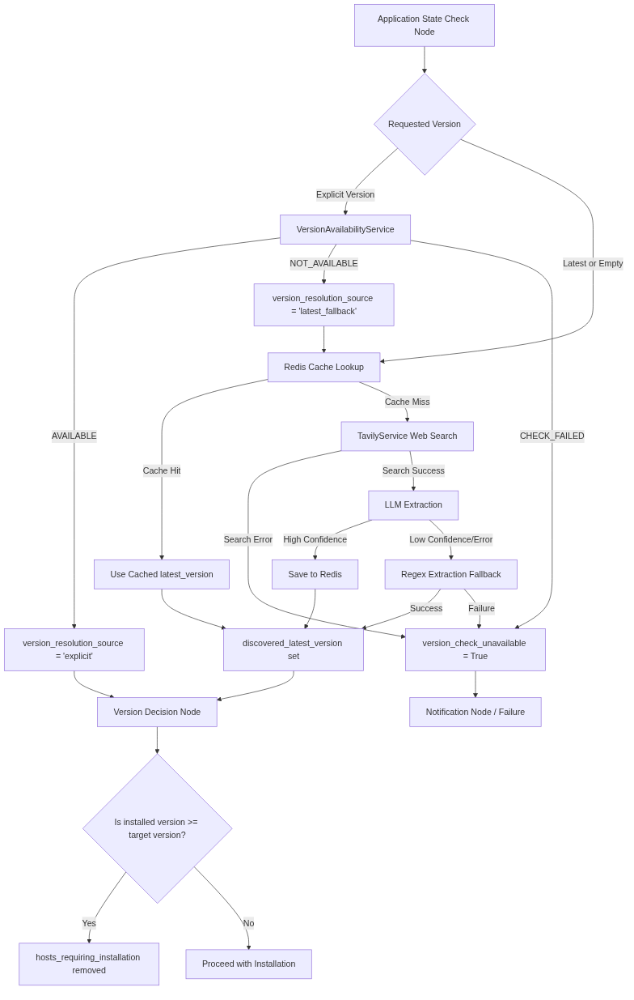
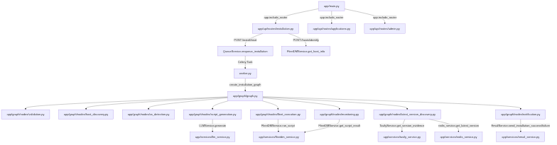
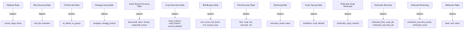

# ApplicationHub Architecture

## 1. High-Level Architecture

## 2. Installation Workflow

## 3. Script Execution Flow

## 4. Version Resolution

## 5. Code-Level Flow

## 6. State Flow

## 7. Important Files

| Component | File | Responsibility |
|-----------|------|----------------|
| FastAPI Entry | `app/main.py` | FastAPI application initialization and CORS setup |
| Installation API | `app/api/routes/installation.py` | Exposes endpoints for UI to trigger and monitor installations |
| Applications API | `app/api/routes/applications.py` | Serves available applications for the frontend |
| Celery Worker | `worker.py` | Processes background tasks, triggering LangGraph |
| Graph Setup | `app/graph/graph.py` | Compiles the LangGraph state graph and defines node routing |
| State Object | `app/graph/state.py` | Defines `InstallationState` for the workflow |
| Script Generation | `app/graph/nodes/script_generation.py` | Wraps LLM Service to generate safe, OS-specific install scripts |
| FleetDM Service | `app/services/fleetdm_service.py` | Communicates with FleetDM to identify hosts and run scripts |
| Redis Service | `app/services/redis_service.py` | Caches latest application versions |
| Tavily Service | `app/services/tavily_service.py` | Searches the web for the latest application version |

## 8. API Entry Points

| Method | Endpoint | File | Purpose |
|--------|----------|------|---------|
| POST | `/install/{application_id}` | `app/api/routes/installation.py` | Creates a new installation job |
| POST | `/install/{job_id}/start` | `app/api/routes/installation.py` | Enqueues the installation job to Celery |
| GET | `/install/{installation_id}` | `app/api/routes/installation.py` | Returns the current status of a job |
| POST | `/hosts/identify` | `app/api/routes/installation.py` | Identifies a FleetDM host ID using its IP |
| GET | `/applications` | `app/api/routes/applications.py` | Lists available applications |
| WebSocket | `/ws/installation/{job_id}` | `app/api/routes/installation.py` | Real-time installation progress updates |

## 9. External Integrations

- **FleetDM**: Used to resolve hosts by IP/hostname and to execute shell/Python scripts remotely.
- **Tavily / FastMCP**: Searches the web to identify the newest package versions when "latest" is requested.
- **LLM (Ollama/gemma4:31b-cloud)**: Generates Python/Bash/PowerShell scripts and analyzes them for risk.
- **Redis**: Caches version discovery results and handles WebSocket pub/sub broadcasting.
- **PostgreSQL / SQLite**: Stores application data and job history.
- **Email (SMTP)**: Sends success/failure notifications at the end of the graph execution.
- **Celery**: Background task runner to offload LangGraph execution from the FastAPI request cycle.
